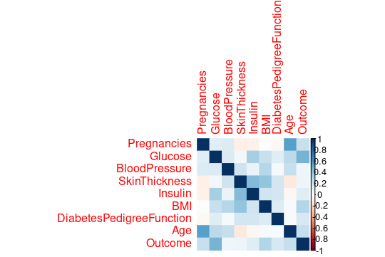
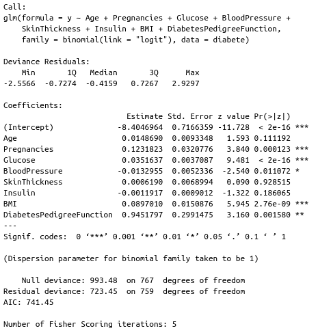
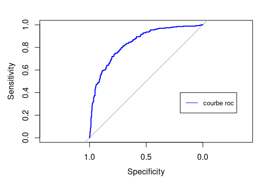
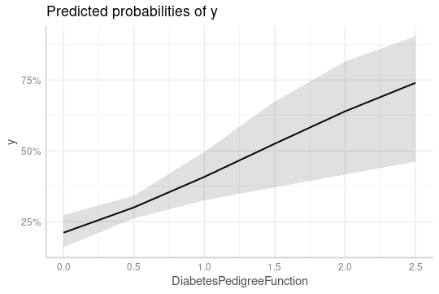
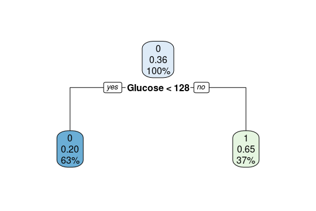

# Prédiction de diabéte chez un individu

L’objectif de ce projet est de prédire la présence de diabètes chez un patient en fonction de certaines caractéristiques cliniques.
Dans ce travail la régression logistique a été testé dont le but d'identifier les facteurs de risque associés au diabète.
***


la base de données diabete.csv contient 9 vairiables, et 768 observations; <br/>
les variables sont les suivantes:<br/>
—Pregnancies : Nombre de fois qu'une femme peut tomber enceinte<br/>
—Glucose : Concentration en glucose plasmatique <br/>
—BloodPressure : Pression artérielle diastolique (mm Hg)<br/>
—SkinThickness : Épaisseur du pli cutané des triceps (mm)<br/>
—Insulin : Insuline sérique de 2 heures (mu U / ml)<br/>
—BMI : Indice de masse corporelle (poids en kg / (taille en m 2 )) <br/>
—DiabetesPedigreeFunction : Fonction pedigree du diabète <br/>
—Age<br/>
—Outcome: variable binaire (1=patient malade, 0=patient non malade)<br/>
"Outcome est la variable d'intérêt elle est expliquée par les autres variables". <br/>
Voici un apercu de la base: avec la commande head(diabetes)<br/>

***


```{r, include=F}
#Chargement des librairies
library(nnet)
library(broom)
installed.packages("ggplot2")
library(ggplot2)
library(GGally)
library(forestmodel)
library(carData)
library(effects)
library(ggeffects)
```
# 1/ Analyse statistique de la base de données
```{r, include=F}
diabete=read.csv("diabetes.csv", header=TRUE)
diabete
M=as.matrix(diabete)
M # transformation de la base en une matrice
dim(diabete)
d0<-diabete[which(diabete$Outcome==0),-9] #-9 pour enlever la variable Outcome
dim(d0) 
d1<-diabete[which(diabete$Outcome==1),-9] #-9 pour enlever la variable Outcome
dim(d1) 
#***Correlation
correlation=cor(M)
correlation
symnum(correlation, abbr.colnames=FALSE)


library(corrplot)
#install.packages("corrplot")
corrplot(correlation, method="color")

```


```{r, include=F}
hist(diabete$Outcome, col="pink")
xtabs(Outcome~Age, data=diabete) 
```


# 2/faire la regression logistique avec glm 
```{r, include=F}
y=as.factor(diabete$Outcome)   #une variable qui prends des valeures enre 0 et 1
modele=glm(y~Age+Pregnancies+Glucose+BloodPressure+SkinThickness+Insulin+BMI+DiabetesPedigreeFunction,data=diabete,family=binomial(link="logit"))
```
# 3/ affichage des résultats du modéle
```{r, include=F}
summary(modéle)
```

Aprés avoir construit le premier modèle avec la fonction glm, on fixe un seuil de 5% les
variables sont toutes  significatives sauf "Age", "Insulin" et "SkinThickness" dont la p-value > 0.O5. <br/>
#  4/ calcul  des odds-ratio et leurs intervalles de confiances
```{r, include=F}
modele$coefficients       ##coefficients beta chapeaux
odd_ratio=exp(modele$coefficients )    #reccuperer les odds-ratio
l=confint(modele)              #affichage des intervalles de confiances
g=cbind(odd_ratio,l)
```

#######################################################################################################
```{r, include=F}
library(broom)
tmp <- tidy(modele, conf.int = TRUE, exponentiate = TRUE)
str(tmp)
```


# avec forestmodel  
```{r, include=F}
install.packages("forestmodel")
library(forestmodel)
forest_model(modele)
```
<br/> Avec la librairie forestmodel on peut observer les variables qui sont des facteurs a risque:
"Pregnancies", "BMI" et "DiabetesPedigreeFunction".<br/>


# 5/ réduire le nombre de variables soit avec la fonction stepAIC ou a la main
# methode 1): stepAIC
```{r, include=F}
library(MASS)
reg=stepAIC(modele,scale = 0,k=2) #Age + Pregnancies + Glucose + BloodPressure + Insulin + BMI + 
#DiabetesPedigreeFunction (se sont les variables qui influance le plus sur la maladie du diabéte
```
# methode 2):
 autre methode: on fixe un seuil a 0.05 puis on fait la regression et avec summary on va s'interesser aux p-value des variables 
 et on enleve a chaque fois la variable qui a la plus grande p-value  puis on refait la regression pour ce nouveau modéle
 et on répéte le processus jusqu'a l'obtention d'un modéle avec des variables significatives <br />
```{r, include=F}
reg1=glm(y~Age+Pregnancies+Glucose+BloodPressure+Insulin+BMI+DiabetesPedigreeFunction,data=diabete,family=binomial(link="logit"))
summary(reg1)
reg2=glm(y~Age+Pregnancies+Glucose+BloodPressure+BMI+DiabetesPedigreeFunction,data=diabete,family=binomial(link="logit"))
summary(reg2)
reg3=glm(y~+Pregnancies+Glucose+BloodPressure+BMI+DiabetesPedigreeFunction,data=diabete,family=binomial(link="logit"))
summary(reg3)
```
<br />

 Grace à la fonction stepAIC de la librairie MASS on s'est retrouvé avec le modéle suivant dont 
"Outcome" est expliqué par quatre variables seulement : "Glocuse", "Pregnancies", "BMI" et "Diabe-
tesPedigreeFunction".<br/>

# 6/ analyse des résultats avec ggeffect 
```{r, include=F}
install.packages("ggeffects")
library(ggeffects)
install.packages("effects")
library(effects)
ggeffect(modele, "Age")
ggeffect(modele, "Pregnancies")
ggeffect(modele, "Glucose")
ggeffect(modele, "BloodPressure ")
ggeffect(modele, "Insulin")
ggeffect(modele, " BMI")
ggeffect(modele, "DiabetesPedigreeFunction")
plot(allEffects(modele))
```
# 7/prédiction
```{r, include=F}
pred.diab=predict(modele,type="response") 
pred.diab#afficher la probabilité de chaque individu  associée a la variable outcome
install.packages("pROC")
library(pROC) #courbe roc 
plot(roc(y,pred.diab),col="blue")
legend(0.2, 0.4, legend=c("courbe roc"),
      col=c("blue"), lty=1.0:0.0, cex=0.8)
 ```
 
 ```{r, include=F}
ggeffect(modele)
plot(ggeffect(modele))
```

```{r, include=F}
#install.packages("caret")
library(caret)
indtrain <- createDataPartition(diabete$Outcome,p=0.8,list=F)
dtrain <- diabete[indtrain,]
dtest <- diabete[-indtrain,]
```
# Fonction qui calcule le taux d'erreur
```{r, include=F}
tx_er <- function(pred,vrais){
  mc <- table(pred,vrais)
  1 - sum(diag(mc))/sum(mc)
}
```
# Classification suppervisée
### CART
```{r, include=F}
# Arbre max

library(rpart)
mcartmax <- rpart(as.factor(Outcome)~.,data=dtrain,cp=0,minbucket=1,maxdepth=30)
predcartmax <- predict(mcartmax,newdata=dtest,type="class")
te_cartmax <- tx_er(predcartmax,dtest$Outcome) 
te_cartmax 
confusionMatrix(dtest$Outcome,predcartmax)#erreur=1-accuracy
rpart.plot(mcartmax) #on trouve un arbre compliqué donc il faut élaguer
plotcp(mcartmax)
# Elagage
mcart <- prune(mcartmax,cp=0,044)
predcart <- predict(mcart,newdata=dtest,type="class")
te_cart <- tx_er(predcart,dtest$Outcome)
te_cart 
rpart.plot(mcart) 
# Arbre à 1 noeud
mdecstump <- rpart(as.factor(Outcome)~.,data=dtrain,cp=0,maxdepth=1)
preddecstump <- predict(mdecstump,newdata=dtest,type="class")
te_decst <- tx_er(preddecstump,dtest$Outcome) 
te_decst
rpart.plot(mdecstump) 
```
# arbre a un noeud

######################################################################
# knn
```{r, include=F}
library(class)
knn1 = knn(train = dtrain[,1:8],test = dtest[,1:8],cl = dtrain[,9],k = 1)
summary(knn1)
table(dtest$Outcome,knn1)
accuracy = sum((dtest$Outcome==knn1)/length(dtest$Outcome))*100
accuracy
```
###########
```{r, include=F}
dtest$Outcome=as.factor(dtest$Outcome)
dtrain$Outcome=as.factor(dtrain$Outcome)
knn = list()
accuracy = numeric()
for (i in 1:70) {
  knn = knn(train = dtrain[,1:8],test = dtest[,1:8],cl = dtrain[,9],k = i,
            prob = TRUE)
  summary(knn)
  table(dtest$Outcome,knn)
  accuracy[i] = sum((dtest$Outcome==knn)/length(dtest$Outcome))*100
  accuracy
}
################################################################################################
plot(x = accuracy,pch = 20,col = "red")
abline(h = max(accuracy))
abline(v = which(accuracy==max(accuracy)))
# k=17 et k=23 fournis un bon modele

summary(knn1)
knn1 = knn(train = dtrain[,1:8],test = dtest[,1:8],cl = dtrain[,9],k = 23)
table(dtest$Outcome,knn1)
accuracy = sum((dtest$Outcome==knn1)/length(dtest$Outcome))*100
accuracy

d0<-dtest[which(dtest$Outcome==0),-9] #-7 pour enlever la variable Outcome
dim(d0) #100 de 0
d1<-dtest[which(dtest$Outcome==1),-9] #-7 pour enlever la variable Outcome
dim(d1) #53 de 1
summary(knn1)
```
avec knn le taux de mauvaise prediction est de 21%   <br/>

#Récapitulatif :
*arbre de cart: le modèle trouvé est très complexe avec un taux d'erreur de mauvaise prédiction est de 30 %<br/>
*Knn : le taux d'erreur de mauvaise prediction est de 21% <br/>
*Dans les deux modèles les taux d'erreur sont très élevés donc ils sont rejetés  <br/>


5/effet de chaque vairiable sur Outcome : <br/>

