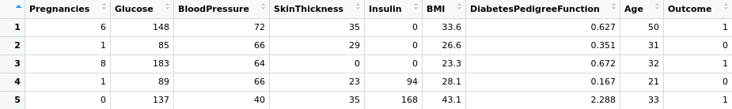
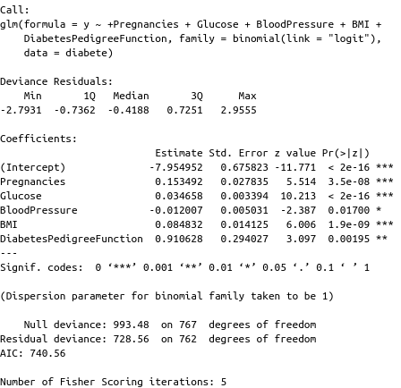
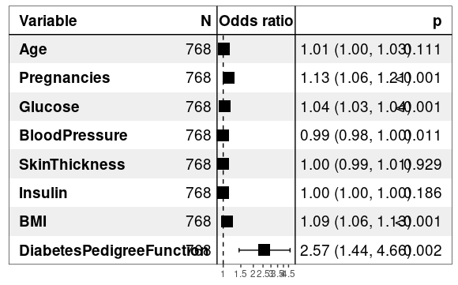
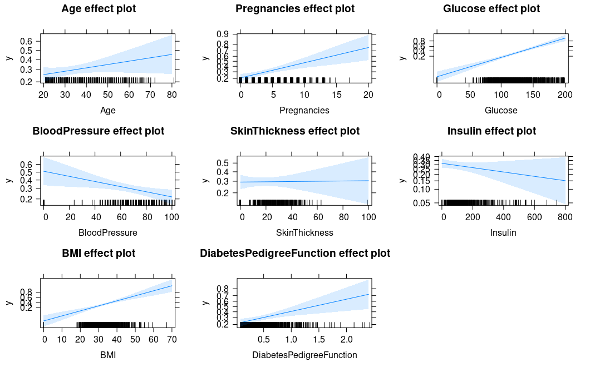

# diabetes-prediction
L’objectif de ce projet est de prédire la présence de diabète chez un patient en fonction de certaines charactéristiques cliniques. 
Dans ce travail la regression logistique a était testé dont le but d'identifier les facteurs de risque associée au diabète.
***
1/ 

la base de données diabete.csv contient 9 vairiables, et 768 observations;  
les variables sont les suivantes: 
—Pregnancies : Nombre de fois qu'une femme peut tomber enceinte 
—Glucose : Concentration en glucose plasmatique  
—BloodPressure : Pression artérielle diastolique (mm Hg) 
—SkinThickness : Épaisseur du pli cutané des triceps (mm) 
—Insulin : Insuline sérique de 2 heures (mu U / ml) 
—BMI : Indice de masse corporelle (poids en kg / (taille en m 2 ))  
—DiabetesPedigreeFunction : Fonction pedigree du diabète  
—Age 
—Outcome: variable binaire (1=patient malade, 0=patient non malade) 
"Outcome est la variable d'interet elle est expliquée par les autres variables".
Voici un apercu de la base: avec la commande head(diabetes) 

***
2/

Aprés avoir construit le premier modèle avec la fonction glm, les
variables sont toutes  significatives sauf "Age", "Insulin" et "SkinThickness".  

3/
odds-ratio: 

 Grace à la fonction stepAIC de la librairie MASS on s'est retrouvé avec le modéle suivant dont 
"Outcome" est expliqué par quatre variables seulement : "Glocuse", "Pregnancies", "BMI" et "Diabe-
tesPedigreeFunction". 

  Avec la librairie forestmodel les variables qui sont des facteurs a risque sont:
"Pregnancies", "BMI" et "DiabetesPedigreeFunction". 

 
effet de chaque vairible sur Outcome

4/Remarques : (Classification suppervisée: arbre de cart et knn ) 
arbre de cart: le e modèle trouvé est trés complexe avec un taux d'erreur de mauvaise prédiction est de 30% 
knn : le taux d'erreur de mauvaise prediction est de 21%  
Dans les deux e modèles les taux d'erreur sont trés elevés donc ils sont rejetés.

